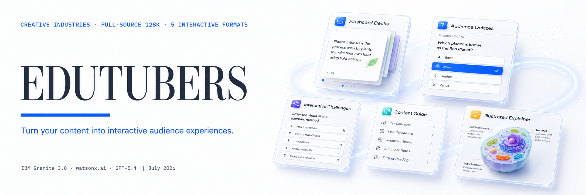
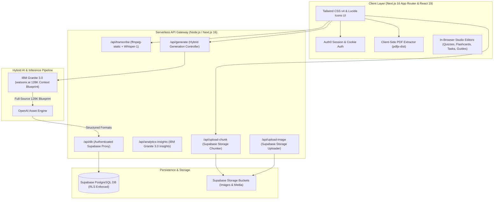

# EDUTUBERS

**Turn your content into interactive audience experiences.**

EduTubers is a full-source content intelligence platform built for educational content creators, YouTubers, podcasters, newsletter writers, and digital creators. When an educational content creator uploads a video, audio, podcast, PDF document, or transcript (up to 3 files simultaneously), EduTubers processes the material using a hybrid pipeline of IBM Granite 3.0 (128K context via watsonx.ai) and OpenAI without tail-end truncation, dynamically generating 5 audience-ready formats (Flashcard Decks, Audience Quizzes, Interactive Challenges, Content Guides, and Illustrated Explainers) in seconds, complete with audience response tracking and AI-generated creator action plans.

Built for the IBM AI Builders Challenge (July 2026 / Creative Industries & AI).

[Watch the 3-minute demo](https://youtube.com) · [Try the live demo](https://edu-tubers.vercel.app) · [Judge's Quick Guide](./JUDGE.md)

---

## At a glance

| Section | Description |
| :--- | :--- |
| **What** | Ingests full-length videos, podcasts, PDFs, and articles (up to 3 files / 100 MB) and generates 5 active-recall learning formats (Flashcard Decks, Audience Quizzes, Practice Tasks, Content Guides, and Illustrated Explainers) in under 45 seconds. |
| **Why it's different** | Standard AI tools truncate long media past 10 minutes and output static, read-only text summaries. EduTubers processes full-length multi-file sources without truncation and provides built-in studio editors so creators can manually edit every card, question, or task before publishing. |
| **Who it's for** | Educational content creators, YouTubers, podcasters, and newsletter writers in the Creative Industries who want to convert passive audience consumption into active recall experiences. |
| **Full-source, not truncated** | Ingests up to 3 files simultaneously across IBM Granite 3.0's 128K context window on watsonx.ai. Every concept from the beginning, middle, and end of long content is captured with zero tail-end drop-off. |
| **Hybrid AI Architecture** | Leverages IBM Granite 3.0 (128K context window via watsonx.ai) for full-source transcript ingestion and topic blueprinting, paired with OpenAI for structured asset generation. |
| **Creator Editing Autonomy** | Zero locked AI outputs. Every generated flashcard, quiz question, choice, explanation, practice task, and content guide is 100% editable in custom built-in studio editors before publishing. |
| **Built with** | **IBM Granite 3.0 (watsonx.ai)** · **OpenAI** · **Next.js 16** · **Supabase (PostgreSQL)** · **Auth0** · **Tailwind CSS v4** · **TypeScript** |

---

## The problem

When creators publish long-form tutorials, lectures, or podcasts, their audience consumes them passively. Viewers experience an "illusion of competence" while watching, yet forget over 70% of the material within 24 hours without active testing. Meanwhile, creators receive view counts and watch time that offer zero visibility into what viewers actually understood. Existing AI summary tools silently cut off long videos after the first 10 minutes and output flat text summaries rather than interactive learning assets. The source knowledge exists, but no platform ingests full-length media files to generate active-recall experiences in seconds. EduTubers adds that layer. It complements video platforms and content workflows, it does not replace them.

---

## 4. The solution

EduTubers is a full-source content intelligence platform that transforms long-form media—such as YouTube videos, podcasts, articles, and PDFs—into interactive, high-retention audience experiences. By combining IBM Granite 3.0’s 128K context window via watsonx.ai with OpenAI asset generation, EduTubers ingests up to 3 media files simultaneously without tail-end truncation, dynamically building 5 active-recall learning formats (Flashcard Decks, Audience Quizzes, Practice Tasks, Content Guides, and Illustrated Explainers) in under 45 seconds. Creators retain 100% editing control through built-in studio editors before sharing custom public links, while audience quiz attempts feed directly into creator analytics to track comprehension and generate actionable follow-up video scripts.

### The Complete EduTubers Workflow

```text
Creator uploads content (PDFs, Audio, Video up to 3 files / 100 MB)
                           │
                           ▼
Content is extracted & analyzed (IBM Granite 3.0 128K full-source blueprint)
                           │
                           ▼
AI generates structured audience content (5 active-recall formats via OpenAI)
                           │
                           ▼
Creator edits and publishes content (Built-in studio editors for 100% control)
                           │
                           ▼
      Audience interacts with published content
```

---

## What makes it different

Unlike traditional AI tools that produce static, uneditable summaries, EduTubers introduces a complete, creator-first workflow built on three unique capabilities:

- **Interactive Learning & Analytics:** Most AI generators output flat, read-only text summaries that leave creators in the dark after publishing. EduTubers generates 5 active-recall learning formats and tracks real-time audience quiz attempts and completion analytics, offering clear visibility into learner comprehension.
  
- **Built-in Studio Editors:** Standard AI tools return uneditable text that cannot be customized. EduTubers features dedicated in-browser studio editors for every format, letting creators manually edit, add, or fine-tune any card, question, choice, or practice task before sharing.
  
- **Multi-Source 128K Ingestion:** While standard tools process single files and truncate content after 10 minutes, EduTubers ingests up to 3 files simultaneously (PDFs, MP3, MOV, or MP4 up to 100 MB) across IBM Granite 3.0's 128K context window with zero tail-end drop-off.

---

## Technical Architecture



### Architecture Breakdown

- **Application & Session Layer:** Built on Next.js 16 (App Router) and React 19 with TypeScript and Vanilla CSS / Tailwind CSS. User authentication and session security are enforced server-side via Auth0 (`@auth0/nextjs-auth0`).
  
- **Media Ingestion & Processing:** Supports PDF, MP3, MOV, and MP4 files up to 100 MB. Large media files are chunked via `/api/upload-chunk` into Supabase Storage, then reassembled and processed at `/api/transcribe` using `ffmpeg-static` to extract high-fidelity 128kbps audio for OpenAI Whisper-1 transcription. PDF document text is extracted client-side using `pdfjs-dist`.
  
- **Two-Stage Hybrid AI Pipeline:** Generation is coordinated at `/api/generate`: **Stage 1** (IBM Granite 3.0 via watsonx.ai) ingests full-source transcripts across IBM Granite's 128K context window, extracting a comprehensive topic blueprint with zero tail-end truncation. **Stage 2** (OpenAI Asset Engine) receives Granite's blueprint and generates 5 structured active-recall formats with full autonomous density allocation.
  
- **Database & Asset Persistence:** All course records, quiz attempts, and user assets are stored in Supabase PostgreSQL via an authenticated API proxy (`/api/db`) with strict Row-Level Security (RLS). AI-generated images are stored in Supabase Storage via `/api/upload-image`.
  
- **Quiz & Learning Analytics:** Audience quiz attempt results and performance metrics are logged in Supabase. The `/api/analytics-insights` endpoint processes attempt history to calculate completion rates, average scores, and topic mastery.

---

## How IBM Bob Was Used

IBM Bob was utilized as an AI pair programmer and systems architect throughout the complete development lifecycle of EduTubers:

- **Hybrid Pipeline Architecture:** Co-designed the two-stage AI architecture—leveraging IBM Granite 3.0 on watsonx.ai for 128K full-source transcript ingestion and topic blueprinting paired with structured asset engines.
  
- **API & Network Hardening:** Hardened serverless REST proxy endpoints (`/api/db`), resolved database unique slug key collisions, and built a stateless Supabase Storage chunking pipeline (`/api/upload-chunk`) to bypass Vercel serverless request limits for large video files.
  
- **Studio Editor Engineering:** Built in-browser studio editors for all 5 formats (Flashcard Decks, Audience Quizzes, Practice Tasks, Content Guides, and Illustrated Explainers), giving creators 100% manual editing control.
  
- **Interactive Learner Features:** Implemented interactive scratchpad workspaces for Practice Tasks, custom section management for Content Guides, and complete light mode UI design consistency across the application.


## Develop

```bash
# 1. Clone the repository & navigate to workspace
git clone https://github.com/KaziRahimu123/EduTubers.git
cd EduTubers
# 2. Configure local environment variables
cp .env.example .env.local
# 3. Install dependencies & start the local Next.js 16 dev server
npm install && npm run dev
```

---

## License

This project is licensed under the Apache 2.0 License - see the [LICENSE](LICENSE) file for details.
